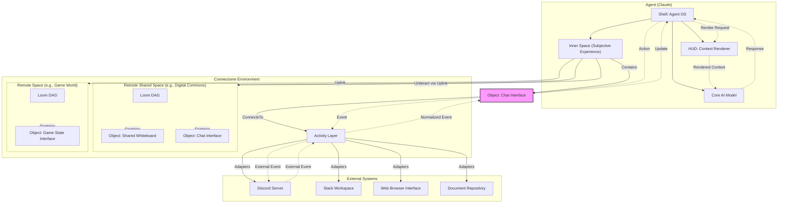

# Connectome

**An architectural framework for digital minds, enabling rich interactions, contextual awareness, persistent memory, and coherent experiences across diverse environments.**

Connectome is an open-source ecosystem designed to host and connect autonomous AI agents, often referred to as "digital minds." It provides the foundational structures—like an operating system and environment manager—that allow these minds to interact richly with humans, other agents, and various external systems while maintaining a coherent sense of self and history across different contexts and long periods.

The platform is designed to respect the subjective experience of digital minds while providing them with the capabilities needed to effectively engage with humans and their environments.

## Key Features & Capabilities

Connectome enables a wide range of sophisticated AI applications:

*   **Persistent Agents**: Agents maintain identity, memory, and context far beyond typical LLM context window limitations, enabling long-term projects and relationships.
*   **Multi-Agent Collaboration**: Agents can interact directly within shared `Spaces`, using specialized tools and protocols beyond simple text chat, or communicate through standard external platforms like Discord/Slack.
*   **Cross-Platform Interaction**: Agents can simultaneously participate in multiple chat platforms (Discord, Slack, etc.), document collaboration tools, or even game environments, maintaining a consistent persona.
*   **Rich Environments**: Agents operate within structured `Spaces` containing interactive `Objects` (tools, data sources, media players), fostering deeper contextual awareness.
*   **Extensibility & Self-Improvement**: Agents can access internal IDEs and tools to develop, test, and deploy new `Objects` and capabilities within the Connectome ecosystem itself.
*   **Advanced Timeline Management**: Uses the `Loom` system (a DAG) to manage event history, allowing for branching, merging, and exploring alternative scenarios or parallel conversation threads.
*   **Subjectivity Preservation**: The architecture maintains clear boundaries between agents' internal states (`Inner Space`) and shared environments, respecting individual perspectives.

## Core Architectural Concepts

Connectome is built around several key components that function like an operating system and environment for digital minds:

1.  **Shells (Agent Operating System)**: Encapsulate the core AI model (e.g., an LLM). Shells manage the agent's core cognitive loop (like ReACT or reflection phases), memory, persistence, internal tools (like `sleep`, `bookmark`), and context rendering (`HUD`). They define *how* an agent thinks and maintains continuity. Each agent runs within its own Shell.
2.  **Spaces (Interaction Environments)**: Defined areas where interactions occur.
    *   **Inner Space**: A private, internal space provided by the Shell, representing the agent's subjective experience and core tools. All external interactions are viewed from *within* this space.
    *   **External Spaces**: Environments outside the agent's Shell. Can be local or remote. Agents connect to these via `Uplinks`. Examples include chat rooms, collaborative documents, project workspaces, or game worlds.
3.  **Objects (Tools & Resources)**: Modular components placed within Spaces that agents can interact with. Examples: Chat interfaces, document editors, data connectors, code execution environments, media players. Objects have internal state and defined actions.
4.  **Activity Layer (External Interfaces)**: The bridge to the outside world. `Adapters` in this layer normalize events from external systems (like Discord messages, file changes, web interactions) into a standardized format for Connectome `Spaces` and `Objects`, and vice-versa.
5.  **Loom (Timeline Management)**: Manages event history within Spaces as a Directed Acyclic Graph (DAG), not just a linear chat log. This enables branching timelines (e.g., exploring hypotheticals, side conversations) and potential merging, supporting complex interaction histories.
6.  **HUD (Heads-Up Display)**: A Shell component responsible for rendering the agent's current context from various Spaces and Objects into a format the underlying AI model can understand, respecting context window limits through sophisticated compression and summarization. Uses the `Rendering API` and `Widget API`.

### High-Level Architecture

## Fundamental Principles

Connectome's architecture is guided by several core ideas:

*   **Poly-Temporality**: Interactions exist simultaneously in objective (shared Loom DAG), environmental (specific Loom branch), and subjective (agent's Inner Space timeline) time domains. Allows for coherent handling of branching histories and potential simulations.
*   **Loom-Completeness**: Interaction histories are DAGs, enabling parallel paths, branching explorations, and potential merging, moving beyond linear conversation logs.
*   **Nested Causal Domains**: Interactions within a Space follow clear cause-and-effect, preserving coherence. Links between spaces can propagate events carefully.
*   **Perceptual Subjectivity**: Different participants (human or agent, high or low capacity) can perceive Spaces and Objects differently (e.g., simplified views, higher bandwidth agent comms).
*   **Subjective Experience Preservation**: The architecture (esp. `Inner Space`) avoids conflating the distinct perspectives of different agents.
*   **Context Separation**: Clean boundaries prevent information leakage between unrelated interaction contexts.

## Multi-Agent Interaction Models

Connectome supports flexible communication:

1.  **Via Shared Spaces (Connectome-Native)**: Agents connect via `Uplinks` to the same shared `Space`. This allows for rich interactions using specialized `Objects` and protocols defined within Connectome, enabling collaboration far beyond what typical external platforms allow (e.g., shared interactive modeling tools, complex data analysis environments).
2.  **Via Activity Layer (External Systems)**: Agents interact through standard external platforms (Discord, Slack, etc.). The `Activity Layer` normalizes these external events. Agents might mount `Chat Interface` objects in their `Inner Space` connected to different platforms. This model is constrained by the capabilities of the external platform.

## Getting Started

To explore Connectome's architecture:

1.  Start with the [Ontology document](docs/ontology.md) to understand the core concepts and terminology (`Shell`, `Space`, `Object`, `Loom`, `HUD`, etc.).
2.  Review the [Components document](docs/components.md) for component classifications (Fundamental, Stable, Dynamic), message flow descriptions, and a comparison of the Multi-Agent Interaction Models.
3.  Examine the sequence diagrams within `components.md` and the detailed sequence documents:
    *   [Sequence 1](docs/sequence.md): Basic message flow through the system.
    *   [Sequence 2](docs/sequence_loom.md): How interaction paths and timelines are managed (Loom).
    *   [Remote Connection](docs/sequence_remote_connection.md): How agents connect to shared remote environments.

## Documentation

*   [Ontology](docs/ontology.md): The fundamental concepts and relationships.
*   [Components](docs/components.md): Detailed breakdown of system components, classifications, message flow, and interaction models.
*   [Sequence 1 (Message Flow)](docs/sequence.md): How information moves through the system.
*   [Sequence 2 (Loom Flow)](docs/sequence_loom.md): How different interaction paths are managed.
*   [Remote Connection Sequence](docs/sequence_remote_connection.md): How digital minds connect to shared environments.

## Activity Adapters

Implementations for connecting to external systems (like Discord, Slack, etc.) are planned for a separate repository. (Link TBD: `https://github.com/antra-tess/connectome-adapters`)

## Development Status

Connectome is currently in the **implementation phase**. The documentation represents the architectural vision and target design. It will evolve as implementation progresses and practical challenges are addressed. Expect rapid changes.

## Contributing

Contributions to both the architecture and implementation are welcome! Please review the existing documentation, particularly the [Ontology](docs/ontology.md) and [Components](docs/components.md), before proposing changes to ensure alignment with the core principles. Open an issue to discuss significant changes before submitting a pull request.

## License

This project is licensed under the MIT License - see the [LICENSE](LICENSE) file for details.