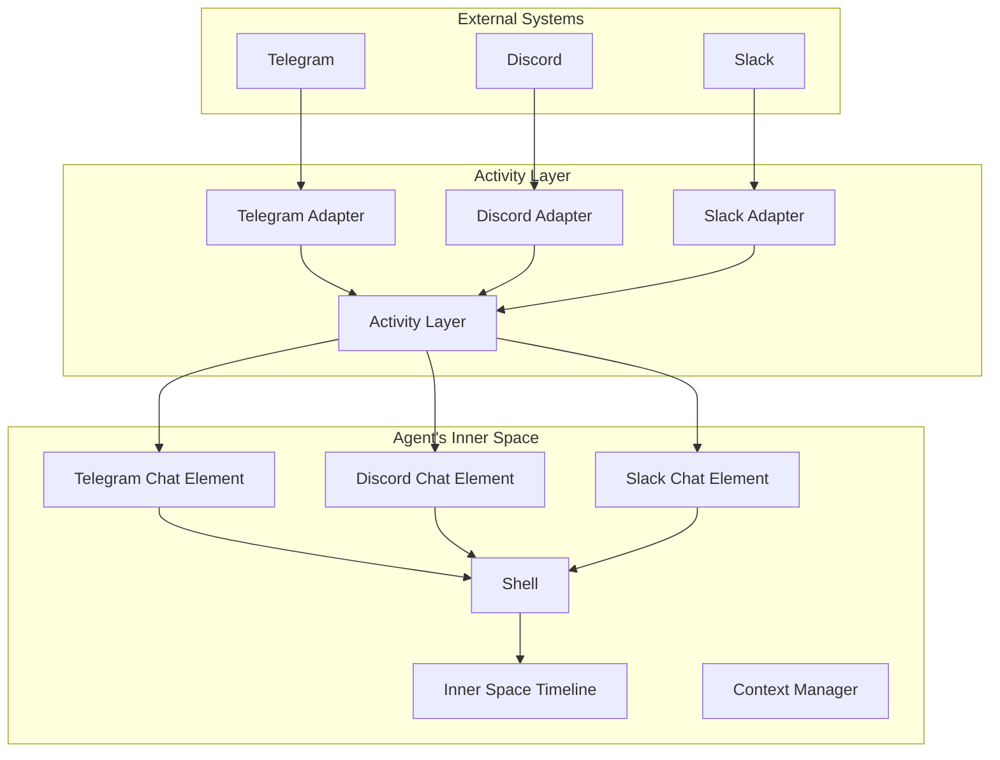
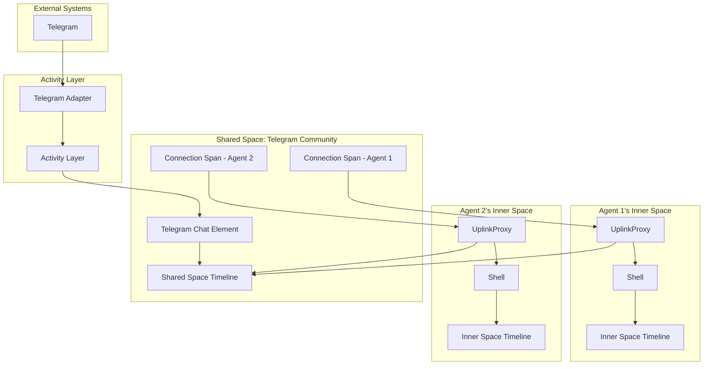
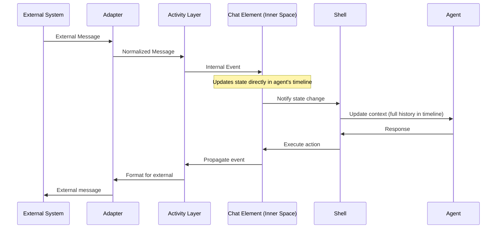
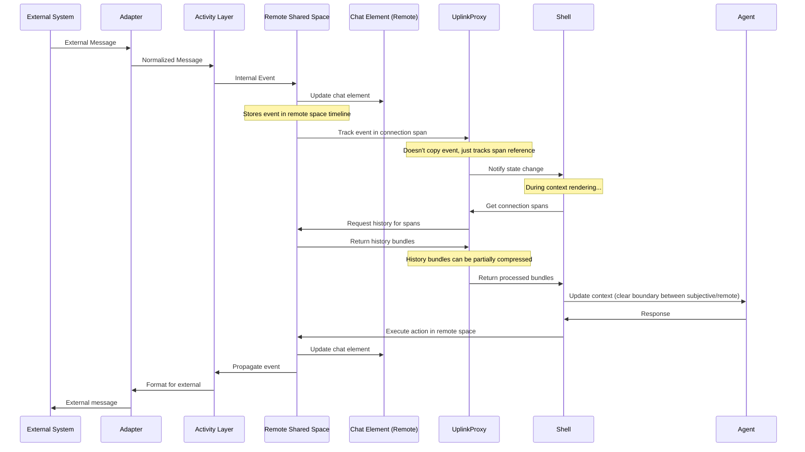

# Connectome Architecture: Components and Interaction Flows (Revised Draft)

## 1. Introduction

This document details the key components of the Connectome framework and describes how they interact to enable rich, context-aware experiences for digital minds. It builds upon the foundational concepts defined in the [Connectome Ontology](ontology.md). Understanding these components and their relationships is crucial for developing within or extending the Connectome ecosystem.

The architecture emphasizes modularity, separation of concerns, and leveraging core primitives like Spaces, Events, and Components consistently throughout the system, including for agent-internal functions.

## 2. Architectural Overview

Connectome operates across several conceptual layers, from the host operating system to the agent's subjective experience within a Space.

*   **Host Processes:** At the base level, **Hosts** (OS processes) run the necessary Connectome services. A Host contains various **Modules**.
*   **Modules:** These provide core infrastructure and bridging capabilities. Key types include the agent's **Shell**, **Activity Adapters** (linking to external systems), **Uplink Infrastructure** (for networking), and **Persistence Backends**.
*   **Spaces:** The primary "in-world" environments. Spaces are specialized **Elements** managed within a Host. They define **time domains** using **Loom DAGs**, contain other Elements, manage event flow, and cache presentation data (**VEIL Deltas**). An agent's **InnerSpace** is a crucial Space managed by its Shell. **Shared Spaces**, accessed via **Uplinks**, enable multi-participant interaction.
*   **Elements & Components:** The building blocks within Spaces. **Elements** are identifiable containers; **Components** attached to them hold all state and implement all behavior, reacting to **Events**.
*   **VEIL (Presentation Layer):** `VeilProducer` Components generate an abstract representation (**VEIL**) of Element state, transmitted as **Deltas**.
*   **HUD & Agent Context:** The agent's **HUD** (implemented via Components in InnerSpace) consumes VEIL deltas, maintains an internal representation (`S_HUD`), and generates the final textual **Context** presented to the agent model.
*   **Interaction Flow:** Agent actions modify Component state within a Space, generating Events and subsequent VEIL Deltas. External events flow through Activity Adapters into Spaces. Information flows between local and remote Spaces via Uplinks, primarily using VEIL Deltas.

**(Diagram placeholder - A high-level block diagram showing Host -> Modules -> Spaces -> Elements/Components, with arrows for Events, VEIL Deltas, Actions, Uplink Communication would go here later)**

## 3. Component Classification

Understanding the stability of different parts of the architecture helps guide development and extension efforts. Components are classified into three categories:

### Fundamental (F)

Core architectural concepts defining the system's nature. Changes represent major framework revisions.

*   **Host / Module Distinction:** The concept of OS-level processes hosting functional modules.
*   **Space / Element / Component Ontology:** The core building blocks of the "in-world" environment.
*   **Event Propagation Core:** The mechanism for event flow within a Space.
*   **Shell Concept (as Agent Runtime):** The idea of a dedicated runtime managing the agent loop and InnerSpace.
*   **Space as Time Domain / Loom Management:** The intrinsic link between Spaces and loomable event DAGs (Polytemporality).
*   **VEIL Concept (as Presentation Layer):** The principle of separating state representation (`VEIL`) from underlying state, generated by sources and consumed by renderers. *(Classified as F for the *concept* of this separation)*

### Stable (S)

Important interfaces, protocols, and patterns designed for evolution with backward compatibility.

*   **VEIL Delta Format & Core Semantics:** The specific structure and meaning of VEIL nodes, features, and delta operations. *(Classified as S for the *specific standard*)*
*   **Component API Patterns:** Standard interfaces for common Component types (e.g., `VeilProducer`, `ActionHandler`).
*   **Event Structure:** The basic format of Event objects.
*   **Space Frame / Delta Synchronization Mechanism:** The pattern of Spaces defining frame boundaries and caching/notifying VEIL deltas.
*   **Uplink Protocol:** The communication standard used by `Uplink Infrastructure` Modules.
*   **Activity Adapter Interface:** Standard way Adapters interact with Spaces/external systems.
*   **Core Feature Annotations (VEIL):** The established set of standard feature categories (Temporality, Salience, etc.).

### Dynamic (D)

Specific implementations that can be swapped, extended, or vary significantly without altering the core architecture.

*   **Specific Module Implementations:** e.g., Concrete `Shell` interaction models (two-phase, etc.), specific `Activity Adapter` code, `Persistence Backend` drivers.
*   **Specific Component Implementations:** Logic within individual Components (e.g., `ChatMessageList` state logic, `VeilProducer` rendering logic).
*   **Specific Space Implementations:** Logic defining frame boundaries, event handling rules within a custom Space type.
*   **HUD Implementation Details:** The specific algorithms used by HUD components for rendering, compression, focus handling based on VEIL features.
*   **VEIL Feature Interpretation:** How different HUDs or Context Managers choose to *use* VEIL feature annotations.
*   **Agent Models:** The underlying LLMs used within Shells.


## 4. Key Interaction Flows (Pseudocode Examples)

These sequences illustrate how information moves through the revised Connectome architecture.

### Flow 1: External Event to Agent Context

**Scenario:** A message arrives on Discord, intended for a channel represented within Connectome.

**Participants:**
*   `DiscordAdapter` (Activity Adapter Module)
*   `SharedSpace_Discord` (Space Element, potentially on a separate Host)
*   `ChatElement_ChannelX` (Element within `SharedSpace_Discord`)
*   `ChatVeilProducer` (Component on `ChatElement_ChannelX`)
*   `Space_DeltaCache` (Conceptual cache within `SharedSpace_Discord`)
*   `UplinkInfrastructure_Client` (Module on Agent's Host)
*   `UplinkInfrastructure_Server` (Module on Shared Space's Host)
*   `Agent_InnerSpace` (Agent's primary Space)
*   `UplinkElement_Discord` (Element in `Agent_InnerSpace`)
*   `HUD_VeilStateCache` (Component on a HUD Element in `Agent_InnerSpace`)
*   `HUD_ContextRenderer` (Component on a HUD Element in `Agent_InnerSpace`)
*   `AgentModel` (The LLM)

**Sequence:**

1.  **External Reception (Module):**
    ```pseudocode
    // DiscordAdapter Module receives event from Discord API
    DiscordAdapter.onExternalMessage(discordMsg) {
      normalizedEvent = this.normalize(discordMsg) // -> { spaceId: "SharedSpace_Discord", targetElementId: "ChatElement_ChannelX", type: "new_message", data: {...} }
      targetHost = HostRegistry.findHostForSpace("SharedSpace_Discord")
      targetHost.routeEventToSpace(normalizedEvent)
    }
    ```

2.  **Space Event Processing (Remote Space):**
    ```pseudocode
    // SharedSpace_Discord receives event
    SharedSpace_Discord.receiveEvent(event) {
      // --- Start Frame ---
      eventID = this.loom.addEvent(event.parentEventId, event.data) // Add to DAG -> evt-501
      this.currentFrame.addEvent(eventID)
      
      // Propagate event to target Element's Components
      targetElement = this.getElement(event.targetElementId) // ChatElement_ChannelX
      targetElement.dispatchEvent(event.data, eventID) 
      
      // Components update their internal state...
      // Assume ChatMessageList component adds the message

      // --- End Frame --- (Space defines its frame boundary logic)
      this.processFrameEnd(this.currentFrame) 
    }

    SharedSpace_Discord.processFrameEnd(frame) {
      changedElements = this.findChangedElements(frame) // -> [ChatElement_ChannelX]
      frameDeltas = []

      for (element in changedElements) {
        if (element.hasComponent(VeilProducer)) {
          veilProducer = element.getComponent(VeilProducer) // ChatVeilProducer
          // Calculate NET delta for all changes within this frame
          delta = veilProducer.calculateDelta(frame.startEventId, frame.endEventId) 
          this.deltaCache.store(element.id, frame.startEventId, frame.endEventId, delta)
          frameDeltas.push({ elementId: element.id, delta: delta }) 
        }
      }

      // Notify observers (connected Uplinks) about the completed frame and available deltas
      this.broadcastFrameCompletion(frame.endEventId, frameDeltas) 
    }
    ```
    *Note: `broadcastFrameCompletion` sends info via `UplinkInfrastructure_Server` to connected `UplinkInfrastructure_Client` modules.*

3.  **Uplink Propagation (Infrastructure & Element):**
    ```pseudocode
    // Agent Host's UplinkInfrastructure_Client receives notification
    UplinkInfrastructure_Client.onRemoteFrameComplete(remoteSpaceId, frameEndEventId, availableDeltaInfos) {
      // Find the corresponding Uplink Element in InnerSpace
      uplinkElement = InnerSpaceRegistry.findUplinkElement(remoteSpaceId) // UplinkElement_Discord
      if (uplinkElement) {
        // Notify the UplinkElement component within InnerSpace
        uplinkElement.dispatchEvent({ type: "remote_frame_ready", frameEndEventId: frameEndEventId, deltaInfos: availableDeltaInfos })
      }
    }
    ```

4.  **InnerSpace Event & HUD Update:**
    ```pseudocode
    // Agent_InnerSpace processes the event targeted at UplinkElement_Discord
    Agent_InnerSpace.receiveEvent(event) { // Event { type: "remote_frame_ready", ... }
      // Standard event propagation within InnerSpace...
      // Assume this eventually reaches HUD components listening for these events
      
      // HUD_VeilStateCache component reacts
      HUD_VeilStateCache.onRemoteFrameReady(event) {
         // Decide if we need these deltas based on focus, etc. Assume yes.
         remoteSpaceId = event.sourceElement.remoteSpaceId // Get space ID from UplinkElement
         deltasToFetch = event.deltaInfos 
         
         // Request deltas from the Space's cache via the Uplink
         retrievedDeltas = this.queryRemoteDeltaCache(remoteSpaceId, deltasToFetch) 
                                // Uses UplinkElement -> UplinkInfrastructure
         
         // Apply retrieved deltas to internal VEIL state S_HUD.V_internal
         this.applyDeltas(retrievedDeltas) 
         
         // Optionally, notify other HUD components or Inner Loop that relevant state changed
         this.dispatchEvent({ type: "veil_state_updated", changes: [...] })
      }
    }
    ```

5.  **Context Generation (Agent Turn):**
    ```pseudocode
    // Inner Loop component decides it's time for agent turn
    InnerLoopComponent.requestContextGeneration() {
      hudRenderer = this.getElement("HUD_RendererElement").getComponent(HUD_ContextRenderer)
      hudRenderer.generateContext()
    }

    // HUD_ContextRenderer component generates context
    HUD_ContextRenderer.generateContext() {
      // Access the current state from HUD_VeilStateCache and config components
      currentVeilState = HUD_VeilStateCache.getCurrentVeilState() // S_HUD.V_internal
      renderConfig = HUD_ConfigStorage.getConfig() // S_HUD.Config_render
      localAnnotations = HUD_AnnotationStore.getAnnotations() // S_HUD.A_local

      // Combine state, config, annotations
      fullHudState = { veil: currentVeilState, config: renderConfig, annotations: localAnnotations } // S_HUD

      // Apply rendering rules, compression, ordering based on fullHudState
      contextString = this.renderEngine.render(fullHudState) 
      compressedContext = this.compressionEngine.compress(contextString, renderConfig.compressionPolicy)

      // Present to Agent Model (via Shell Module interface)
      ShellModule.presentContextToAgent(compressedContext) 
    }
    ```

### Flow 2: Agent Action to External System

**Scenario:** Agent sends a message to the Discord channel via Connectome.

**Participants:** (Mostly the same, adding Agent's Shell)
*   `AgentModel`
*   `ShellModule`
*   `Agent_InnerSpace`
*   `ChatInputElement` (Element in `Agent_InnerSpace`, maybe)
*   `ActionHandlerComponent` (On `ChatInputElement` or `UplinkElement_Discord`)
*   `UplinkElement_Discord`
*   `UplinkInfrastructure_Client / _Server`
*   `SharedSpace_Discord`
*   `ChatElement_ChannelX`
*   `ActivityAdapter_Discord` (Module on Shared Space Host)

**Sequence:**

1.  **Agent Response:**
    ```pseudocode
    // AgentModel generates response containing an action
    agentResponse = "<action target='ChatInputElement' name='send_discord_msg' params='{ \"content\": \"Hello from Connectome!\" }'/>"
    ShellModule.receiveAgentResponse(agentResponse) 
    ```

2.  **Shell Action Parsing & Dispatch:**
    ```pseudocode
    ShellModule.receiveAgentResponse(response) {
      parsedAction = this.actionParser.parse(response) // -> { targetElementId: "ChatInputElement", name: "send_discord_msg", ... }
      
      // Dispatch action to the InnerSpace to target the element
      Agent_InnerSpace.dispatchAction(parsedAction) 
    }
    ```

3.  **InnerSpace Action Handling:**
    ```pseudocode
    // Agent_InnerSpace routes action to the target element
    Agent_InnerSpace.dispatchAction(action) {
       targetElement = this.getElement(action.targetElementId) // ChatInputElement
       // Assumes ChatInputElement has an ActionHandler component
       actionHandler = targetElement.getComponent(ActionHandlerComponent)
       actionHandler.handleAction(action)
    }

    // ActionHandler on ChatInputElement (or potentially UplinkElement directly)
    ActionHandlerComponent.handleAction(action) {
      if (action.name == "send_discord_msg") {
         // This handler knows it needs to send via the Discord uplink
         uplinkElement = this.getElement("UplinkElement_Discord") 
         uplinkElement.sendRemoteAction(
             "post_message", // Action name understood by remote ChatElement
             { content: action.params.content, sender: AgentContext.agentId } 
             // Sends via UplinkInfrastructure_Client
         )
      }
    }
    ```
    *Note: An event (`agent_action_sent`) might be added to InnerSpace Loom here.*

4.  **Uplink Transmission:**
    ```pseudocode
    // UplinkInfrastructure_Client sends request to Server
    // UplinkInfrastructure_Server receives request on Shared Space Host
    UplinkInfrastructure_Server.onRemoteActionRequest(request) {
       // Authenticate/authorize based on session associated with the connection
       if (this.isValidAction(request)) {
          // Route action to the target Space
          SharedSpace_Discord.dispatchAction(request.action) 
       }
    }
    ```

5.  **Remote Space Action Processing:**
    ```pseudocode
    // SharedSpace_Discord receives action from Uplink Server
    SharedSpace_Discord.dispatchAction(action) { // Action: { targetElementId: "ChatElement_ChannelX", name: "post_message", ... }
       // --- Start Frame --- (Could be same frame or new one)
       targetElement = this.getElement(action.targetElementId) // ChatElement_ChannelX
       // Assume ChatElement has ActionHandler component
       actionHandler = targetElement.getComponent(ActionHandlerComponent)
       actionResult = actionHandler.handleAction(action) // -> Updates ChatElement state, adds M4
       
       // Add corresponding event to Loom DAG
       eventID = this.loom.addEvent(...) // evt-502: agent posted M4
       this.currentFrame.addEvent(eventID)
       
       // --- End Frame ---
       this.processFrameEnd(this.currentFrame) // Generates VEIL delta for M4, caches it
                                               // Broadcasts frame completion (including delta info)
                                               // This update flows back to AgentA's HUD via Flow 1, Steps 3-5
    }
    ```

6.  **Remote Space Propagation to Activity Adapter:**
    ```pseudocode
    // ChatElement's ActionHandler, after successfully posting message M4 internally:
    ActionHandlerComponent.handleAction(...) {
       // ... updated internal state ...
       
       // Check if this action needs external propagation
       if (this.shouldPropagateExternally("post_message")) {
          // Get the associated Activity Adapter Module reference
          adapter = ModuleRegistry.getActivityAdapter("ActivityAdapter_Discord")
          
          // Prepare external format
          externalMsg = adapter.formatForExternal(
              { type: "new_message", data: messageM4Details }
          )
          
          // Send via the Adapter Module
          adapter.sendExternalMessage(externalMsg) 
       }
    }
    ```

7.  **External Delivery (Module):**
    ```pseudocode
    // ActivityAdapter_Discord sends message via Discord API
    ActivityAdapter_Discord.sendExternalMessage(externalMsg) {
       discordApiClient.sendMessage(externalMsg.channelId, externalMsg.text, ...)
    }
    ```

## 5. VEIL (Visual Encoding and Information Layer)

VEIL is a crucial **Stable (S)** component in the Connectome architecture, acting as an intermediate representation layer that decouples the underlying state of Elements within a Space from their final presentation to an agent (via Context) or a human (via UI).

### 5.1. Purpose and Role

*   **State vs. Presentation Separation:** VEIL provides an abstract description of *how* an Element's state *should be presented*, distinct from the Element's internal state itself (which resides in its Components).
*   **Intermediate Representation:** It serves as the common language between state generation (by `VeilProducer` Components within a Space) and state consumption/rendering (by HUD Components within an agent's InnerSpace or potentially by UI frameworks).
*   **Enabling Sophisticated Consumers:** VEIL provides rich structural information and descriptive feature annotations, allowing HUDs, Compression Engines, and Context Managers to make intelligent decisions about rendering, prioritization, summarization, and context construction based on agent needs and goals.
*   **Efficiency:** Transmitted primarily as **Deltas (`ΔV`)**, enabling efficient updates to observers without sending the full representation state repeatedly.

### 5.2. Generation and Transmission

1.  **Generation:** `VeilProducer` Components, attached to Elements within a Space, are responsible for generating VEIL. When an Element's state changes due to events within a Space-defined **Frame**, its `VeilProducer` calculates the net **VEIL Delta (`ΔV`)** representing the change in its intended presentation between the start and end of that frame. `VeilProducer` components can leverage standard libraries for common delta calculations.
2.  **Caching:** The Space caches these generated `ΔV` keyed by Element ID and the frame's start/end event IDs.
3.  **Notification:** At the end of each frame, the Space broadcasts an `onFrameEnd` event (or similar notification) to observers, indicating which Elements have updated VEIL deltas available in the cache.
4.  **Retrieval:** Consuming components (like the HUD's `VeilStateCache`) listen for `onFrameEnd` and query the relevant Space's cache (typically via an Uplink for remote spaces) to retrieve the necessary `ΔV`.
5.  **Full State:** `VeilProducers` can also generate the full VEIL state (`V(t)`) for a specific timeline point `t` on demand (e.g., for initial loading or resynchronization).

### 5.3. Structure and Core Concepts

VEIL itself is typically conceptualized as a **tree structure**, composed of nodes. While the specific serialization format (e.g., JSON, XML-like) is secondary, the logical structure includes:

*   **Nodes:** The basic building blocks.
*   **`veil_id`:** A unique identifier for a node within the scope of its parent Element's VEIL, crucial for applying deltas. Must be stable across frames unless the underlying conceptual entity is removed.
*   **`node_type`:** Defines the fundamental structural role (e.g., `'container'` for nodes holding children, `'content'` for leaf nodes holding primitive values like text).
*   **Hierarchy:** `container` nodes have an ordered `children` list.
*   **Content (`value`):** `content` nodes hold the primitive payload, typically text. References to non-textual data are handled via `metadata`.
*   **Deltas (`ΔV`):** Operations (`add_node`, `update_node`, `remove_node`, `move_node`) acting on nodes identified by `veil_id`, describing changes between Space frames.

### 5.4. Feature Annotations (Metadata)

This is where VEIL derives much of its power. Nodes carry rich metadata, providing descriptive features for interpretation by the HUD/CM system. These features *describe* the information, rather than prescribing exactly how it must be handled. Key categories include:

*   **Provenance:** Links back to the source Element ID, Space ID, and the specific Loom Event ID(s) corresponding to the VEIL state/delta. Essential for grounding and context.
*   **Temporality:** Information about creation/modification time (relative to Loom events), hints about expected `volatility` (`static`, `frequent`, `streaming`), and `lifespan` (`transient`, `persistent`).
*   **Salience & Attention:** Hints describing the information's nature and suggested handling regarding agent attention. Examples:
    *   `source_intent`: (e.g., `status_update`, `direct_request`, `ambient_info`, `error_message`, `user_content`).
    *   `directedness`: (e.g., `self`, `specific_agent`, `group`, `broadcast`).
    *   `novelty_indicator`: Flags genuinely new information.
    *   `persistence_suggestion`: Hints for stable placement in context ("constant depth").
    *   `focus_request`: Signals an Element's desire to narrow the context scope (`suggested`, `strong`, `force`).
*   **Content Nature:**
    *   `modality`: (`text`, `image_ref`, `audio_ref`, `structured_data_ref`, `interactive`).
    *   `semantic_type`: Broad classification (e.g., `instruction`, `narrative`, `code_block`, `system_status`, `social_interaction`).
    *   `structural_role`: Hint for rendering/interpretation (e.g., `heading`, `list_item`, `table_cell`).
*   **Actionability:**
    *   `affordances`: List of possible interaction types (e.g., `clickable`, `editable`, `replyable`).
    *   `action_descriptor`: Contains the necessary details (target Element, action name, parameters) for the Shell to execute an action associated with this VEIL node.
*   **Integrity & Representation:**
    *   `verbatim_requirement`: Hint to avoid summarization/alteration.
    *   `summarization_resistance`: Hint about difficulty/lossiness of summarizing.
    *   `alternative_representations`: Links/hints to other VEIL views or data sources.
*   **Relationships:** Explicit links between VEIL nodes (`reply_to_id`, `references_id`, `part_of_id`, `causal_successor_of_id`).

### 5.5. Consumption (by HUD/UI)

*   The HUD's `VeilStateCache` component maintains the agent's current view of the world by applying incoming `ΔV` to its internal VEIL tree representation (`S_HUD.V_internal`).
*   The HUD's `ContextRenderer` component reads this internal state (`S_HUD`), interprets the structure and feature annotations according to its configured policies (rendering rules, compression strategies, focus handling), and generates the final `Context` string for the agent model.
*   Similarly, UI frameworks would consume VEIL (or deltas) to render visual interfaces for human users, interpreting features relevant to visual layout, styling, and interaction.

---

This section defines VEIL's purpose, generation/transmission mechanism (deltas synchronized by Space frames), core structure, the crucial role of descriptive feature annotations, and how it's consumed. It firmly places VEIL as the structured, annotated presentation layer connecting Space state to agent Context. Does this capture the essence and requirements of VEIL as we discussed?

# Architecture Insights

The concept of cycle completion is Fundamental, while the specific next steps vary by Shell implementation (Dynamic).

## Key Architecture Insights

1. **Layered Stability**
   - Fundamental components form the backbone, rarely changing
   - Stable components allow for evolution without breaking changes
   - Dynamic components encourage diverse implementations and experimentation

2. **Protocol-Based Interoperability**
   - Standard protocols enable component substitution
   - Elements can be swapped while preserving interface contracts
   - Different Shell implementations can interoperate with the same Spaces

3. **Separation of Rendering and State**
   - Elements own their state (Fundamental)
   - Delegates control rendering (Stable interface, Dynamic implementation)
   - Shell manages assembly and compression (Stable API, Dynamic algorithms)

4. **Space-Element-Shell Relationship**
   - Spaces provide organizational structure (Fundamental)
   - Elements provide functionality (Dynamic implementation, Stable interface)
   - Shell provides runtime environment and coordination (Fundamental concept, Dynamic implementation)

5. **Extensibility Patterns**
   - New normalized protocols can be added (Stable)
   - New adapter types can be created (Dynamic)
   - New Shell implementations can be developed (Dynamic)
   - New Space types can be designed (Dynamic implementation, Fundamental concept)

This architecture provides a clear separation between the foundational concepts that define the system, the stable interfaces that enable component interoperability, and the dynamic implementations that allow for innovation and customization.

# Multiuser Chat Participation Models

The framework supports two distinct architectural approaches for agent participation in multiuser chats, each with different implications for history management, context rendering, and system scalability.

## Model 1: Direct Chat Elements in Inner Space

In the first model, which is the primary focus of the sequence diagrams shown earlier, chat elements are mounted directly in the agent's Inner Space. External adapters normalize events from various platforms and route them to the appropriate chat elements.



### Key Characteristics:

1. **Direct Integration**: Chat elements are mounted directly in the agent's Inner Space
2. **Timeline Ownership**: All events become part of the agent's subjective timeline in their Inner Space
3. **Adapter-Centric**: Each external system requires a specific adapter to normalize events
4. **Singular History**: Chat history is part of the agent's personal history DAG
5. **Compression Handling**: Chat history is compressed using standard subjective timeline compression techniques
6. **Implementation Complexity**: Each agent needs adapters for every platform they interact with

## Model 2: Uplinks to Remote Shared Spaces

In the second model, agents connect to remote shared spaces through uplinks. These shared spaces maintain their own timelines and can service multiple agents simultaneously.



### Key Characteristics:

1. **Space Separation**: Chat elements exist in separate shared spaces, not in the agent's Inner Space
2. **Connection Spans**: The agent's Inner Space only records connection events (when connected/disconnected)
3. **History Bundles**: History from remote spaces is retrieved as bundles during context rendering
4. **Specialized Compression**: Remote history bundles can be partially compressed:
   - Recent spans may be preserved in full detail
   - Mid-term spans may keep only question-answer pairs
   - Historical spans may be heavily summarized
5. **Efficient Multiagent Support**: Multiple agents can uplink to the same shared space
6. **Reduced Adapter Complexity**: Agents don't need adapters for every platform, just uplink capability
7. **Thread-Aware Processing**: Conversational threads can be preserved during compression

## Model Comparison: Message Processing Flow

The following diagrams illustrate the difference in message flow between the two models:

### Model 1: Direct Chat Processing


### Model 2: Remote Space with Uplink


## Implications of the Two Models

1. **Memory Efficiency**:
   - Model 1 stores all history in the agent's timeline, which can become large
   - Model 2 only stores connection references, retrieving history on demand

2. **Context Clarity**:
   - Model 1 blends all chat history into the agent's subjective experience
   - Model 2 maintains clear boundaries between the agent's subjective timeline and remote observations

3. **History Compression**:
   - Model 1 applies standard compression to all history
   - Model 2 enables specialized partial compression of remote history bundles

4. **Scalability**:
   - Model 1 requires each agent to implement adapters for every system
   - Model 2 allows many agents to share a single implementation of external adapters

5. **Multi-agent Collaboration**:
   - Model 1 has no built-in support for agent-to-agent interaction
   - Model 2 naturally enables multiple agents to interact in shared spaces

Both models have valid use cases within the framework, and implementations can choose the appropriate model based on their specific requirements for memory efficiency, context management, and multi-agent collaboration.